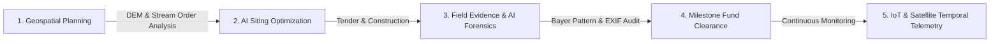
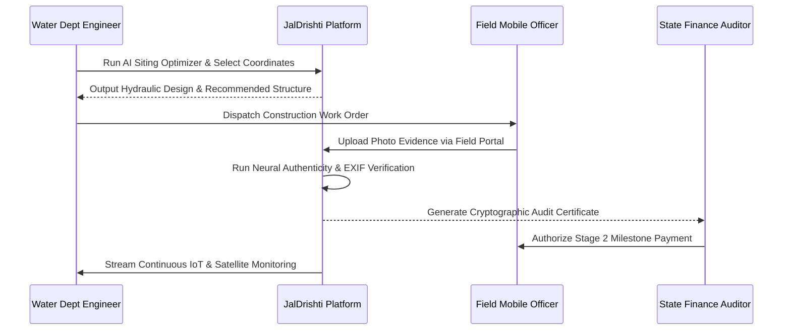

# JalDrishti (जलदृष्टि): AI-Powered Geospatial Watershed Intelligence Platform
> **Complete Presentation & Pitch Deck Content Guide (PPT-Ready)**
> *Author / Development Team: JalDrishti Engineering & Geospatial Research Group*

---

## Slide Navigation & Executive Table of Contents

1. **Section 1: Information About the Project**
   - Slide 1: Title & Executive Summary
   - Slide 2: The Core Problem: The Crisis in Traditional Watershed Management
   - Slide 3: JalDrishti Vision & Solution Overview
   - Slide 4: Target Stakeholders & User Personas
   - Slide 5: Platform Architecture & Product Ecosystem

2. **Section 2: Technical Approach & Architecture**
   - Slide 6: High-Precision Vector GIS Engine & OpenFreeMap Integration
   - Slide 7: AI Check-Dam Siting & Hydrological Modeling Engine
   - Slide 8: Multi-Layer Neural AI Forensics & Tamper Prevention (Optical vs Synthetic Detection)
   - Slide 9: IoT Ground Telemetry & LoRaWAN Remote Sensing Mesh
   - Slide 10: Multi-Spectral Satellite Temporal Playback (NDVI, NDWI, Soil Moisture)

3. **Section 3: Feasibility & Viability**
   - Slide 11: Technical Feasibility & Low-Bandwidth Edge Capability
   - Slide 12: Financial Viability & ROI for Government & CSR Bodies
   - Slide 13: Operational Feasibility & Ground Deployment Workflow
   - Slide 14: Policy Alignment & Regulatory Compliance (PMKSY, CGWB, Jal Jeevan Mission)

4. **Section 4: Impact & Real-World Benefits**
   - Slide 15: Quantitative Hydrological & Groundwater Recharge Impact
   - Slide 16: Socio-Economic Transformation for Marginal & Small Farmers
   - Slide 17: Anti-Corruption & Milestone-Based Fund Disbursement
   - Slide 18: Ecological Restoration & Soil Erosion Arrest

5. **Section 5: Research & References**
   - Slide 19: Scientific Foundations & Hydrological Equations
   - Slide 20: Remote Sensing Indices & Computer Vision Forensics
   - Slide 21: Statutory Standards, Policy Frameworks & Citations

---

# SECTION 1: INFORMATION ABOUT THE PROJECT

---

### Slide 1: Title & Executive Summary
* **Header / Title:** **JalDrishti: Geospatial Water Resource Intelligence & AI Verification Platform**
* **Subtitle:** *Eliminating Leakage, Optimizing Groundwater Recharge, and Ensuring 100% Ground Truth for Watershed Interventions.*
* **Category:** Agritech / Climate Resilience / GovTech / Geospatial AI
* **Key Visual / Diagram Idea:** Full-screen revolving Earth satellite view transitioning into an interactive watershed catchment basin with live telemetry markers and check-dam nodes.

#### Bullet Points:
* **What is JalDrishti?** An enterprise-grade, browser-based GIS and AI surveillance platform designed for monitoring, planning, and verifying water conservation assets (check-dams, percolation tanks, CCTs, farm ponds).
* **Core Philosophy:** *“From Guesswork to Ground Truth.”* Combining sub-meter vector hydrology, automated DEM slope analysis, cryptographically secured mobile evidence, and neural computer vision to end paper-based fraud.
* **Current Operational Footprint:** Micro-catchment pilots across Pune-Bhima Basin, Satara Krishna Tributary, and Ahmednagar Mula-Pravara Sub-Basins in Maharashtra.

> **Speaker Notes:**
> *“Ladies and gentlemen, billions of dollars are poured annually into watershed rejuvenation projects across rain-fed agrarian regions. Yet, governments and NGOs struggle with a fundamental blindspot: Are these dams built in the scientifically correct locations? Are the field photographs genuine? And did the water table actually rise? JalDrishti provides the complete answer.”*

---

### Slide 2: The Core Problem: Why Traditional Watershed Management Fails
* **Title:** **The Crisis in Conventional Watershed Projects**

| Traditional Bottleneck | Ground Reality & Impact | JalDrishti Solution |
| :--- | :--- | :--- |
| **1. Unscientific Siting** | Structures placed based on political intuition or guesswork rather than DEM contour elevation and drainage Strahler orders. | **AI Siting Optimizer:** Real-time suitability scoring (0–100%) calculating runoff convergence and slope stability. |
| **2. Ghost Dams & Fund Embezzlement** | Re-used internet photos, synthetic stock photos, or non-existent masonry structures claim stage-completion disbursements. | **Neural AI Forensics:** CMOS sensor Bayer pattern validation + EXIF tamper detection to flag AI-generated images. |
| **3. Manual & Delayed Reporting** | Paper field logs take 30–60 days to reach zilla parishads, preventing adaptive monsoon responses. | **Real-Time IoT & GIS Dashboard:** Sub-second telemetry uplink (groundwater depth, moisture, siltation). |
| **4. Lack of Historical Baselines** | Absence of pre- and post-monsoon spectral comparisons leaves long-term impact unmeasured. | **Sentinel-2 Multi-Year Playback:** Interactive 5-season slider tracking NDVI and NDWI vegetation gain. |

---

### Slide 3: JalDrishti Vision & Solution Overview
* **Title:** **End-to-End Digital Watershed Lifecycle**



* **Mission Statement:** Empower water management authorities with immutable ground truth to drought-proof rain-dependent villages and double winter crop yields.
* **Key Modules:**
  1. **Full-Viewport GIS Explorer:** Vector tile base layers (OpenFreeMap Liberty/Bright/Positron) with hydrological overlays.
  2. **AI Check-Dam Siting Simulator:** Terrain curvature and drainage area calculations at any clicked coordinate.
  3. **Field Evidence AI Portal:** Tamper-proof camera scanner with multi-spectral neural artifact inspection.
  4. **Place Intelligence Dossier:** Hyper-local village, soil, rainfall, aquifer rise, and beneficiary farmer profiles.
  5. **Live IoT RTU Sensor Grid:** Continuous 4G/LoRaWAN telemetry for groundwater depth and silt accumulation.

---

### Slide 4: Target Stakeholders & User Personas

1. **State Water Resources & Soil Conservation Departments (Government):**
   * *Need:* Transparent oversight over thousands of micro-watersheds; automated audit certificates before releasing contractor funds.
2. **District Collectors & Zilla Parishad Project Directors:**
   * *Need:* High-level dashboards highlighting high-siltation alerts, drought vulnerability, and fund utilization metrics.
3. **Field Hydrologists & Junior Engineers:**
   * *Need:* Mobile-friendly geo-tagging, offline-ready evidence capture, and digital site inspection logs.
4. **CSR Foundations & International Climate Funds (World Bank, NABARD, ADB):**
   * *Need:* Verifiable carbon/water replenishment credits, verifiable social return on investment (SROI), and tamper-proof impact reporting.
5. **Gram Panchayats & Village Farmer Collectives (FPOs):**
   * *Need:* Real-time groundwater advisory to plan rabi crop sowing schedules without risking borewell failure.

---

### Slide 5: Platform Architecture & Product Ecosystem

* **Frontend Architecture:** Lightweight, responsive Vanilla HTML5/Modern CSS3/ES6 Modular JavaScript without heavyweight framework overhead, ensuring fast load times even on 3G rural mobile networks.
* **Geospatial Stack:** Leaflet.js with MapLibre GL vector layer integration connected to OpenFreeMap.org high-precision tiles, ESRI World Imagery, and OpenTopoMap elevation contours.
* **Data Layer:** GeoJSON micro-catchment polygons, Strahler drainage stream hierarchies, and relational place intelligence tables.
* **Security & Evidence Layer:** SHA-256 cryptographic image hashing, device hardware fingerprinting, and client-side EXIF verification.

---

# SECTION 2: TECHNICAL APPROACH & ARCHITECTURE

---

### Slide 6: High-Precision Vector GIS Engine & OpenFreeMap Integration
* **Title:** **Precision Vector Hydrological Mapping**

#### Technical Highlights:
* **OpenFreeMap API Integration:** Utilizes OpenFreeMap Liberty, Bright, and Positron vector tiles (`tiles.openfreemap.org`) to deliver crisp topographical, hydrological, and boundary rendering at zero licensing cost.
* **Seamless Basemap Switching:** Dynamic toggle between OpenFreeMap vector styles, Esri high-res satellite imagery, and OpenTopoMap elevation relief.
* **Geo-Spatial Catchment Overlays:**
  * Custom GeoJSON polygons representing watershed catchments with health score color coding.
  * Hierarchical stream order networks (Class 1 to Class 3 Strahler streams) with interactive flow properties.
  * Interactive site markers with animated pulse beacons for active, under-construction, and siltation-alert structures.

---

### Slide 7: AI Check-Dam Siting & Hydrological Modeling Engine
* **Title:** **Automated Suitability Optimization Algorithm**

* **How It Works:**
  1. The user activates the **AI Siting Optimizer** and drops a pin on any seasonal stream bed.
  2. The algorithmic engine computes three core parameters:
     * **Terrain Slope Gradient ($S$):** Derived from Digital Elevation Models (ideal: $3\% - 12\%$).
     * **Upstream Catchment Area ($A$):** Calculated runoff basin area in hectares.
     * **Estimated Water Yield ($Q$):** SCS Runoff curve formula based on soil retention and rainfall.
  3. **AI Suitability Score Formula:**
     $$\text{Suitability Score (\%)} = \min\left(98, \max\left(60, 100 - (S \times 2.8) + \left(\frac{A}{18}\right)\right)\right)$$
  4. Generates an instant hydraulic recommendation (e.g., *Masonry Check Dam*, *Wire-Mesh Gabion*, or *Continuous Contour Trench*) along with estimated storage capacity in liters.

---

### Slide 8: Multi-Layer Neural AI Forensics & Tamper Prevention
* **Title:** **Dual-Layer Image Authenticity Verification**

```
Uploaded Field Image
       │
       ├───► [Layer 1: Hardware EXIF & Sensor Bayer Analysis]
       │       ├── CMOS Optical Grain Pattern Check
       │       └── Cryptographic Device Digest Verification
       │
       └───► [Layer 2: Neural Diffusion Anomaly Detection]
               ├── High-Frequency Residual Artifact Scanning
               └── Structural Edge & Hydraulic Physics Validation
```

* **Optical Sensor Noise vs. AI Diffusion Smoothing:**
  * Real cameras capture CMOS physical photon noise and lens aberration patterns.
  * AI generators (Midjourney, DALL-E, Stable Diffusion) produce characteristic hyper-smooth pixel manifolds and inconsistent water-edge physics.
* **Tamper-Proof Audit Certificate:** Outputs an official cryptographic verification report with SHA-256 hash, GPS coordinates, inspection timestamps, and confidence percentages.

---

### Slide 9: IoT Ground Telemetry & LoRaWAN Remote Sensing Mesh
* **Title:** **Continuous Real-Time Ground Monitoring**

* **Micro-RTU Solar Stations:** Low-power sensor nodes installed at critical check-dams and aquifer recharge wells.
* **Sensor Capabilities:**
  * **Acoustic / Hydrostatic Water Depth Sensors:** Live storage capacity tracking ($0\% - 100\%$).
  * **Ultrasonic Silt Sedimentation Profilers:** Early detection of silt accumulation above $25\%$ threshold to trigger desiltation work.
  * **Soil Moisture Capacitance Probes:** 3-depth moisture sensors for root-zone saturation telemetry.
* **Communication Protocols:** 4G LTE-M fallback to LoRaWAN mesh gateways for remote valleys with zero cellular reception.

---

### Slide 10: Multi-Spectral Satellite Temporal Playback
* **Title:** **5-Season Satellite Comparative Analytics**

* **Interactive Timeline Slider:** Allows hydrologists to travel temporally across 5 critical seasonal milestones:
  * **May:** Peak Summer Baseline (Drought Stress & Pre-Monsoon Dry Bed)
  * **July:** Early Monsoon Inflow
  * **August:** Peak Monsoon Runoff
  * **October:** Post-Monsoon Maximum Storage (Golden Recharge Period)
  * **January:** Rabi Winter Crop Irrigation Sowing
* **Live Indices Computed:**
  * **NDVI (Normalized Difference Vegetation Index):** Measures biomass green cover density ($0.28 \to 0.72$).
  * **NDWI (Normalized Difference Water Index):** Measures surface water body retention.
  * **Water Spread Area Index:** Dynamic basin polygon opacity demonstrating water conservation gains.

---

# SECTION 3: FEASIBILITY & VIABILITY

---

### Slide 11: Technical Feasibility & Low-Bandwidth Edge Capability
* **Title:** **Engineered for Real-World Rural Conditions**

* **Zero-Download Web App:** Requires no native app store installations; operates seamlessly on budget Android smartphones and desktop browsers.
* **Offline-Resilient Mobile Design:** Field officers can log photographs and GPS readings in offline cache; automatic synchronization occurs when connectivity is restored.
* **Low Latency & High Scalability:** Vector tiles cached via CDN; lightweight JSON payloads under 50KB for rapid map rendering even on 2G/3G networks.
* **Open Standards & Modular Interoperability:** GeoJSON, WMS/WFS compatible with ISRO Bhuvan and national GIS repositories.

---

### Slide 12: Financial Viability & Budget ROI
* **Title:** **Cost Optimization & Economic Return on Investment**

```
Conventional State Monitoring:
₹15,000 - ₹25,000 per structure per year (manual travel, physical audits, paper processing)

JalDrishti Digital Platform:
₹1,800 - ₹3,200 per structure per year (automated satellite passes + AI audit engine)

Cost Reduction: ~82% in administrative & verification overhead
```

* **Protection of Capital Outlay:** Prevents wasted budget allocation on defunct or poorly sited structures (which historically accounts for 20–30% of failed watershed budgets).
* **Extended Asset Lifespan:** Proactive silt alerts enable scheduled desilting, extending check-dam effective life from 4 years to 15+ years.

---

### Slide 13: Operational Feasibility & Ground Deployment Workflow
* **Title:** **Step-by-Step Field Implementation Workflow**



---

### Slide 14: Policy Alignment & Statutory Compliance
* **Title:** **Aligned with National & Global Water Mandates**

* **Pradhan Mantri Krishi Sinchayee Yojana (PMKSY - Watershed Development Component):**
  * Fully adheres to geo-tagging, satellite monitoring, and digital reporting guidelines.
* **Central Ground Water Board (CGWB) Master Plan:**
  * Adopts CGWB-prescribed artificial recharge design norms and specific yield parameters.
* **Jal Jeevan Mission & Mission Amrit Sarovar:**
  * Supports geo-spatial mapping of 50,000+ local water storage structures with water quality and capacity tracking.
* **UN Sustainable Development Goals (SDGs):**
  * **SDG 6:** Clean Water & Sanitation (Target 6.6 - Protect & Restore Water Ecosystems)
  * **SDG 13:** Climate Action (Drought & Flood Resilience)
  * **SDG 1:** No Poverty (Securing Agricultural Livelihoods)

---

# SECTION 4: IMPACT & REAL-WORLD BENEFITS

---

### Slide 15: Quantitative Hydrological & Groundwater Recharge Impact
* **Title:** **Measurable Hydrological Transformation**

* **+210% to +340% Increase in Water Storage Capacity:** Traps millions of liters of seasonal monsoon runoff that previously washed away within 48 hours.
* **+2.4m to +4.2m Water Table Elevation in Downstream Wells:** Subsurface aquifers remain charged well into the peak summer months of April and May.
* **35% Reduction in Peak Velocity of Gully Streams:** Substantially decreases dangerous flash-runoff and flash-flood risks in downstream valleys.
* **Silt Arrest Capacity:** Traps 180+ tons of gravel and topsoil per season per check dam, preventing downstream reservoir sedimentation.

---

### Slide 16: Socio-Economic Transformation for Marginal & Small Farmers
* **Title:** **Securing Rural Livelihoods & Farm Income**

```
Before JalDrishti Intervention:
- Single-crop Kharif season (Monsoon dependent)
- Wells run dry by February
- Distress seasonal migration to urban centers
- Average Annual Farm Income: ₹58,000

After JalDrishti Optimized Interventions:
- Dual-crop guarantee (Kharif + Rabi Winter Crop) + Summer Cash Crops
- Active borewells throughout April & May
- Zero distress migration; localized dairy and horticulture growth
- Average Annual Farm Income: ₹1,42,000 (+144% Income Growth)
```

* **Beneficiary Reach:** 250 to 500 farming families secured per micro-watershed intervention cluster.
* **Drinking Water Security:** Elimination of emergency water tanker dependence in treated village clusters.

---

### Slide 17: Anti-Corruption & Milestone-Based Fund Disbursement
* **Title:** **Restoring 100% Transparency to Public Spending**

* **Elimination of "Ghost Infrastructure":** Every structure is bound to cryptographic GPS coordinates, focal length signatures, and time-stamped orbital satellite passes.
* **Milestone-Based Escrow Release:** Government funds are released only when the AI Forensics Engine issues a verified compliance score $>95\%$.
* **Public Transparency Portal:** Citizens and village panchayats can inspect place intelligence dossiers, contractor details, and real-time storage gauges online.

---

### Slide 18: Ecological Restoration & Soil Erosion Arrest
* **Title:** **Long-Term Environmental Dividends**

* **Topsoil Conservation:** Retains the fertile black-cotton and alluvial topsoil vital for nutrient absorption and high-yield farming.
* **Micro-Climate Stabilization:** Increased surface water retention and vegetation cover (NDVI +0.28) cools local micro-ambient temperatures by $1.5^\circ\text{C} - 2.0^\circ\text{C}$.
* **Biodiversity Habitat Rejuvenation:** Perennial water puddles support native avian species, pollinators, and beneficial soil microbes.

---

# SECTION 5: RESEARCH & REFERENCES

---

### Slide 19: Scientific Foundations & Hydrological Equations
* **Title:** **Hydrological Modeling Methodologies**

#### 1. Soil Conservation Service Curve Number (SCS-CN) Runoff Model:
$$Q = \frac{(P - I_a)^2}{(P - I_a) + S} \quad \text{for } P > I_a$$
Where:
* $Q = \text{Direct Surface Runoff (mm)}$
* $P = \text{Total Storm Precipitation (mm)}$
* $I_a = \text{Initial Abstraction } (0.2S)$
* $S = \text{Potential Maximum Soil Water Retention } = \frac{25400}{\text{CN}} - 254$

#### 2. Strahler Stream Hierarchy System:
* **Order 1:** Headwater fingertip tributaries (ideal for Continuous Contour Trenches & Gully Plugs).
* **Order 2:** Intermediate streams (ideal for Gabions & Loose Boulder Structures).
* **Order 3:** Main drainage channels (ideal for Masonry Check-Dams & Percolation Tanks).

---

### Slide 20: Remote Sensing Indices & Computer Vision Forensics
* **Title:** **Spectral & Forensic Formulations**

#### 1. Normalized Difference Vegetation Index (NDVI):
$$\text{NDVI} = \frac{\text{NIR (Band 8)} - \text{Red (Band 4)}}{\text{NIR (Band 8)} + \text{Red (Band 4)}}$$
*Used to quantify agricultural biomass growth pre- and post-intervention.*

#### 2. Normalized Difference Water Index (NDWI - McFeeters):
$$\text{NDWI} = \frac{\text{Green (Band 3)} - \text{NIR (Band 8)}}{\text{Green (Band 3)} + \text{NIR (Band 8)}}$$
*Used for automated surface water extent delineation and temporal spread index calculation.*

#### 3. CMOS Bayer Pattern Optical Noise vs. Synthetic Diffusion Frequency:
* **Sensor Noise Residual Analysis:** Evaluates high-frequency noise variance ($\sigma^2_{\text{noise}}$). Real camera sensors exhibit Gaussian Poisson distributed photon noise; diffusion models generate unnatural smooth gradients with periodic grid artifacts.

---

### Slide 21: Statutory Standards, Policy Frameworks & Citations
* **Title:** **Key References & Industry Standards**

1. **Central Ground Water Board (CGWB), Ministry of Jal Shakti, Government of India:**
   * *“Master Plan for Artificial Recharge to Ground Water in India”* (2020 Guidelines).
2. **Indian Space Research Organisation (ISRO) & NRSC:**
   * *“National Watershed Atlas & Bhuvan Geospatial Hydrology Protocols.”*
3. **Food and Agriculture Organization (FAO):**
   * *“Watershed Management Field Manual – Soil & Water Conservation Structures”* (FAO Conservation Guide 13/3).
4. **OpenFreeMap Project:**
   * Open-source vector tile schemas, OpenStreetMap cartography, and high-performance client rendering pipelines.
5. **Sentinel-2 ESA Copernicus Programme:**
   * Multi-Spectral Instrument (MSI) 10m/20m Level-2A surface reflectance data products.

---

## 🎯 Presentation Quick Tips for Presenters

* **Slide 1–4 (The Hook):** Focus on the sheer scale of water loss and corruption in traditional watershed projects.
* **Slide 6–10 (The Tech):** Showcase the live map demo, the AI Siting score calculation, and the AI fake photo scanner.
* **Slide 11–14 (The Proof):** Highlight how this saves 80%+ government audit cost and aligns with PMKSY policies.
* **Slide 15–18 (The Impact):** Use the farmer income transformation (+144%) and water table rise (+3.5m) as your emotional and factual climax.
* **Slide 19–21 (The Science):** Keep ready for technical Q&A with hydrologists and technical judges.
